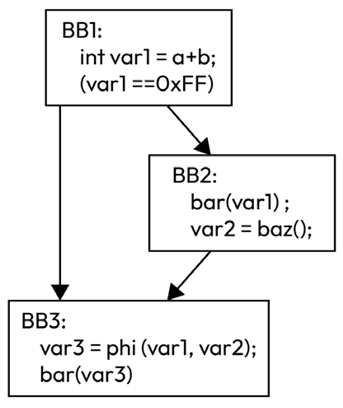

A `phi` instruction copies the input value from the related control flow edge
to the definition of the phi. For instance, in , when the
control flow goes from `BB1` to `BB3` (that is, the left edge – the first value of the phi),
`var1` is copied into `var3`. When the control flow goes from `BB2` to `BB3`,
the second value, `var2`, is copied into `var3`.

To put it differently, `phi` instructions act as if a copy were inserted
on the related incoming edge.

In the LLVM IR and Machine IR levels, `phi` instructions are grouped together
at the beginning of _basic blocks_. It is invalid to insert non-`phi`
instructions before `phi` instructions.

`Phi` instructions are mapped to the `PHINode` class, which is a subclass of
the `Instruction` class, in the LLVM IR and to the `MachineInstr` class
with `getOpcode() == PHI` in the Machine IR.

The optimization in the LLVM IR responsible for promoting memory locations to
SSA values is `mem2reg`.
